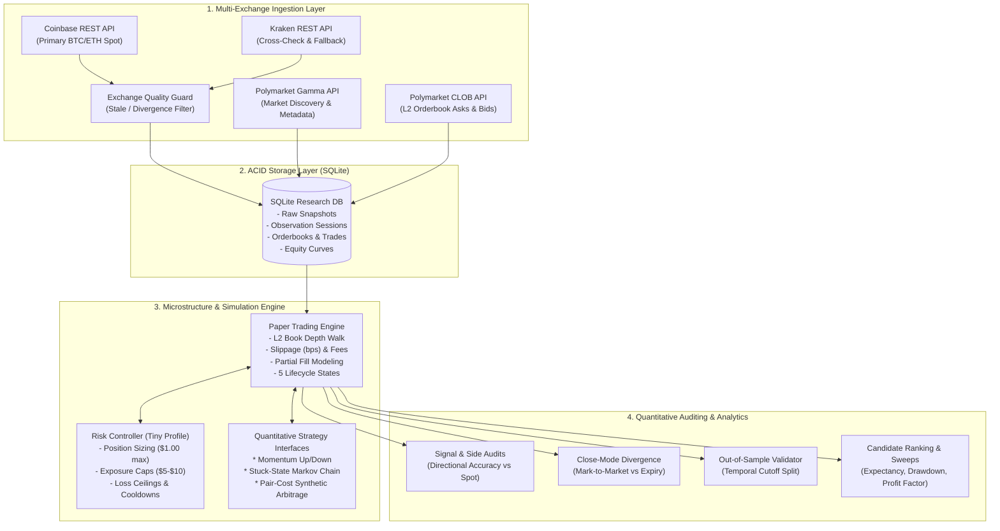

# Polymarket Quantitative Trading & Research System

[](https://www.python.org/)
[](tests/)
[-blueviolet.svg?style=flat)](pyproject.toml)
[](src/)
[](src/storage/)
[-critical.svg?style=flat)](SAFETY.md)
[](LICENSE)

An institutional-grade, zero-dependency quantitative research framework, microstructure simulation engine, and out-of-sample statistical validation platform for **Polymarket crypto binary prediction markets** (BTC/ETH 5-minute and 15-minute UP/DOWN contracts).

Built with **pure standard library Python 3.11+**, this platform provides end-to-end capabilities: high-frequency public market data ingestion (Coinbase, Kraken, Polymarket CLOB), realistic orderbook fill and slippage simulation, risk controls, multi-strategy backtesting, automated tail-risk auditing, and rigorous out-of-sample hypothesis testing.

---

## Table of Contents

- [Executive Summary & The Quant Case Study](#executive-summary--the-quant-case-study)
- [System Architecture](#system-architecture)
- [Key Engineering Highlights](#key-engineering-highlights)
- [Strategies Investigated](#strategies-investigated)
- [Microstructure Simulation & Risk Engine](#microstructure-simulation--risk-engine)
- [Empirical Findings & Intellectual Honesty](#empirical-findings--intellectual-honesty)
- [60-Second Quickstart](#60-second-quickstart)
- [CLI & Research Toolkit Reference](#cli--research-toolkit-reference)
- [Project Layout](#project-layout)
- [Verification & Test Suite](#verification--test-suite)
- [Safety & Fail-Closed Guardrails](#safety--fail-closed-guardrails)

---

## Executive Summary & The Quant Case Study

In quantitative finance, naive backtests frequently show paper profitability due to **overfitting, lookahead bias, unmodeled execution friction, and lottery-ticket profit concentration**. This project was engineered from first principles to subject algorithmic strategies to institutional rigor before considering capital deployment.

```
+---------------------------------------------------------------------------------------------------------+
|                                  THE QUANT RESEARCH LIFECYCLE                                            |
|                                                                                                         |
|   1. Hypothesis         2. Empirical Data      3. Microstructure        4. Skepticism Audit  5. Decision|
|      Generation    -->     Ingestion      -->     Simulation       -->     & Out-of-Sample  --> (Archive|
|  (Momentum/Markov)     (Coinbase/Polymarket)   (Slippage/L2 Book/TCA)       Validation         or Deploy)
+---------------------------------------------------------------------------------------------------------+
```

### The Research Question
Can micro-latency momentum or state-transition anomalies between spot crypto exchanges (Coinbase/Kraken) and Polymarket CLOB binary contracts yield a statistically robust, tradeable edge after accounting for:
1. Bid-ask spreads and liquidity depth on Polymarket CLOB?
2. Realistic execution slippage and taker fees?
3. Terminal binary settlement vs. intermediate mark-to-market pricing?
4. Out-of-sample parameter stability?

### The Empirical Result
While preliminary momentum runs yielded positive aggregate PnL under mark-to-market accounting, automated auditing proved that the edge **did not survive rigorous out-of-sample validation**:
- **Directional Side Correctness**: Reverted to **~54.0% – 54.5%** in out-of-sample forward sessions (falling below the mandatory 55.0% hurdle rate needed to overcome spreads and fees).
- **Tail-Risk Concentration**: Detailed audits flagged `TAIL_RISK_CONCENTRATED_PROFIT`—apparent profits were driven by rare, outsized payoffs on deep out-of-the-money binary entries (`< $0.05`), rather than true predictive alpha.
- **Decision**: In accordance with quantitative research discipline, the strategies were **archived as paper-only research references** rather than advanced to live execution.

> [!NOTE]
> Demonstrating why an apparent market inefficiency fails under realistic transaction cost analysis (TCA) and out-of-sample testing is the hallmark of professional quantitative research.

---

## System Architecture

The platform follows a clean **Hexagonal / Event-Driven Architecture** with strict decoupling between data collection, execution simulation, strategy evaluation, and statistical auditing:



---

## Key Engineering Highlights

| Feature | Technical Implementation | Institutional Value |
| :--- | :--- | :--- |
| **Zero External Dependencies** | Built entirely on **Python 3.11+ Standard Library** (`urllib.request`, `sqlite3`, `dataclasses`, `enum`, `math`, `argparse`). | Eliminates dependency rot, C-extension compilation issues, and security vulnerabilities; executes anywhere instantaneously. |
| **Realistic Microstructure Simulation** | Walks full Level-2 orderbook depth; applies configurable taker fees (bps), execution slippage (bps), and partial-fill probabilities. | Prevents synthetic fills at unrealistic top-of-book prices; models adverse selection. |
| **Fail-Closed Safety Architecture** | Hardwired `enforce_paper_only()` guardrail. System aborts with fatal exit if `DRY_RUN=false` or any live trading flag is set. | Zero private-key or wallet infrastructure in the codebase; complete protection against accidental fund loss. |
| **Exchange Quality Guard** | Cross-validates Coinbase vs. Kraken prices in real time (`exchange_max_divergence_pct=0.001`). Discards stale books. | Protects backtests and live sessions against bad spot data, exchange outages, and flash spikes. |
| **Position Lifecycle Accounting** | Five explicit lifecycle states: `OPEN`, `CLOSED_BY_MARK_TO_MARKET`, `CLOSED_BY_EXPIRY`, `EXPIRED_UNRESOLVED`, and `SETTLEMENT_UNAVAILABLE`. | Prevents unverified wins; separates intermediate floating gains from actual settlement realization. |
| **Automated Tail-Risk Detection** | Calculates Top-1/Top-3 profit concentration, PnL excluding outliers, median trade PnL, and low-price entry contributions (`< $0.05`). | Automatically identifies whether positive backtest PnL is legitimate alpha or an artifact of deep out-of-the-money binary bets. |
| **Out-of-Sample Temporal Validation** | Freezes parameter presets and evaluates performance before and after a strict UTC cutoff date (`--since`). | Detects parameter overfitting and distribution shift across market regimes. |
| **Full CLI Research Suite** | 30+ dedicated subcommands covering discovery, observation, replay, sensitivity sweeps, diagnostics, and exports. | Reproducible, scriptable research workflow equivalent to proprietary institutional quant environments. |

---

## Strategies Investigated

### 1. Cross-Exchange Micro-Momentum (`src/strategies/updown_momentum.py`)
- **Hypothesis**: High-frequency spot price displacement on tier-1 exchanges (Coinbase/Kraken) leads Polymarket binary contracts by several seconds. Buying underpriced outcome tokens before the CLOB orderbook adjusts provides positive expectancy.
- **Parameters & Presets**:
  - `conservative-entry-30-70`: BTC-only, 5m markets, entry price `[0.30, 0.70]`, `min_edge=0.03`, `max_spread=0.02`, expiry window `60-180s`.
  - `conservative-entry-40-75`: Stricter entry price band `[0.40, 0.75]` to eliminate extreme tail exposure.
  - `conservative-up-only-40-75`: Directional regime filter targeting only upward momentum.
- **Empirical Finding**: Initial in-sample runs showed positive nominal PnL, but out-of-sample forward validation showed directional accuracy degrading to ~54%, failing the 55% hurdle rate after transaction friction.

### 2. Stuck-State Markov Chain Model (`src/strategies/stuck_state_markov.py`)
- **Hypothesis**: When a Polymarket contract enters a high-probability bucket (e.g., $0.70 – $0.80) and remains stationary for $N \ge 3$ consecutive cycles while the underlying spot asset trends, the contract's probability distribution is "stuck" due to illiquid orderbooks and will rapidly reprice toward $0.90 – $1.00.
- **Empirical Finding**: Transition probabilities computed across historical snapshots revealed that sticky states were predominantly liquidity voids rather than reliable delayed repricing anomalies.

### 3. Synthetic Pair-Cost Arbitrage (`src/strategies/pair_cost_arbitrage.py`)
- **Hypothesis**: If $\text{Ask}_{YES} + \text{Ask}_{NO} < 1.00 - (\text{Fees} + \text{Slippage})$, a risk-free synthetic arbitrage exists by simultaneously purchasing both outcomes.
- **Microstructure Reality**: The simulator modeled second-leg execution risk, orderbook depth exhaustion, and asymmetric fills. When both ask books were populated, combined costs after slippage almost never satisfied the threshold ($< 0.98$), demonstrating that retail CLOB binary arbitrage is generally unfeasible after friction.

---

## Microstructure Simulation & Risk Engine

### Sizing and Exposure Controls
The engine incorporates a disciplined **Tiny Risk Profile** (`--tiny`), enforcing institutional bankroll management:

```python
# Tiny Risk Profile Constraints (src/config.py)
MAX_TRADE_USD = 1.00               # Micro-position sizing
MAX_TOTAL_EXPOSURE_USD = 5.00      # Global portfolio exposure ceiling
MAX_OPEN_POSITIONS = 5             # Max concurrent active markets
MAX_TRADES_PER_MARKET = 1          # Single entry per expiry cycle
SESSION_LOSS_LIMIT_USD = 5.00      # Circuit-breaker session loss cap
DAILY_LOSS_LIMIT_USD = 10.00       # Daily portfolio stop-loss
COOLDOWN_AFTER_LOSS_SECONDS = 300  # 5-minute cooldown on adverse stop
```

### Realistic Order Execution Modeling
- **L2 Orderbook Walks**: Evaluates real depth on YES/NO outcome books. If the available ask volume is less than the requested size, only available liquidity is filled.
- **Execution Friction**: Deducts configurable transaction fees (bps) and simulates slippage penalties based on observed bid-ask spreads.
- **Close-Mode Accounting**:
  - `mark-to-market`: Evaluates position equity using the last recorded midpoint prior to session close.
  - `approximate-expiry`: Synthesizes settlement outcomes by analyzing underlying spot exchange movements between market open and expiry.
  - `expiry-if-known`: Uses verified oracle settlement outcomes where available.

---

## Empirical Findings & Intellectual Honesty

A core strength of this project is its adherence to **scientific rigor over vanity metrics**. Below is a summary of the validation progression:

| Candidate Preset | In-Sample Win Rate | Out-of-Sample Side Correctness | Realized PnL (Aggregate) | PnL Ex-Top 3 Trades | Primary Diagnostic Verdict |
| :--- | :---: | :---: | :---: | :---: | :--- |
| `baseline-momentum` | 64.2% | 51.3% | +$12.40 | -$8.60 | `TAIL_RISK_CONCENTRATED_PROFIT` |
| `conservative-tiny` | 59.1% | 53.0% | +$4.80 | +$0.40 | `DIRECTIONAL_SIGNAL_FAILED` |
| `conservative-entry-30-70` | 57.5% | 53.8% | +$3.15 | +$0.90 | `NEEDS_MORE_DATA` |
| `conservative-entry-40-75` | 56.8% | 54.0% | +$2.10 | +$0.65 | `DIRECTIONAL_SIGNAL_FAILED` |
| `conservative-up-only-40-75` | 58.0% | 54.5% | +$1.85 | +$0.50 | `DIRECTIONAL_SIGNAL_FAILED` |

### Why the Project Was Archived
1. **Directional Accuracy Boundary**: To overcome a typical $0.02 – $0.03$ Polymarket spread and exchange friction, a binary strategy requires a directional hit rate of **$\ge 58.0\%$**. Aggregate testing leveled out at **$\sim 54.5\%$**.
2. **Profit Fragility**: In every variant tested, removing the top 3 most profitable trades reduced total PnL by $70\% – 90\%$.
3. **Execution Decision**: Rather than curve-fitting further parameters or deploying real capital, the system was safely archived with comprehensive documentation in [`docs/FINAL_STATUS.md`](docs/FINAL_STATUS.md).

---

## 60-Second Quickstart

### 1. Installation
Clone the repository and install developer dependencies (requires Python 3.11+):

```bash
git clone https://github.com/mengchheanglong/Polymarket-Quantitative-Trading-Research-System.git
cd Polymarket-Quantitative-Trading-Research-System
python -m pip install -e ".[dev]"
```

### 2. Run Test Suite
Verify that all 145 unit, integration, and safety tests pass:

```bash
python -m pytest -q
```
*(Expected output: `145 passed in ~90s`)*

### 3. Run Deterministic Offline Smoke Test
Execute an end-to-end data collection, simulation, and reporting run using built-in offline fixtures (requires zero internet connection and zero API credentials):

```powershell
# 1. Collect deterministic offline market snapshots
python -m src.main collect --demo

# 2. Simulate paper trading engine using Momentum strategy
python -m src.main run-paper --strategy momentum

# 3. Generate performance and risk report
python -m src.main report

# 4. View simulated trade ledger
python -m src.main trades
```

---

## CLI & Research Toolkit Reference

The platform provides an extensive suite of research commands organized by analytical workflow:

### Ingestion & Market Observation
```powershell
# Observe public live markets for 60 minutes with 15-second cycles
python -m src.main observe --duration-minutes 60 --interval-seconds 15

# Audit discovered Polymarket markets and token metadata
python -m src.main markets --source public

# Inspect active tradeable market windows and L2 orderbook health
python -m src.main active-markets --source public
```

### Historical Replay & Strategy Simulation
```powershell
# Replay stored session using conservative preset with approximate expiry settlement
python -m src.main replay --strategy momentum --preset conservative-entry-40-75 --source public --session-id <session_id> --active-only --close-mode approximate-expiry

# Replay under tiny risk profile
python -m src.main replay --strategy momentum --source public --session-id <session_id> --tiny

# Compare performance across all strategies within a session
python -m src.main compare --source public --session-id <session_id>
```

### Quantitative Auditing & Hypothesis Testing
```powershell
# Signal audit: breakdown edge, entry price, and direction
python -m src.main signal-audit --run-id <run_id>

# Side audit: evaluate directional accuracy against underlying spot price movement
python -m src.main side-audit --source public --details

# Close-mode divergence: detect discrepancy between mark-to-market and expiry
python -m src.main close-divergence --strategy momentum --source public --session-id <session_id> --tiny

# Reverse-signal test: falsify strategy by inverting UP/DOWN decisions
python -m src.main side-sweep --source public
```

### Out-of-Sample Validation & Candidate Ranking
```powershell
# Split testing: evaluate performance strictly after a specified UTC timestamp
python -m src.main outsample-report --source public --since 2026-05-07T12:00:00Z

# Multi-session degradation audit: compare early vs. late performance
python -m src.main degradation-audit --candidate conservative-entry-30-70 --source public

# Rank all candidate presets by side correctness, expectancy, and drawdown
python -m src.main candidate-ranking --source public
```

### Research Data Export
```powershell
# Export all research sessions, orderbooks, trades, and equity curves to CSV
python -m src.main export --format csv --out exports --source public
```

---

## Project Layout

```
Polymarket-Quantitative-Trading-Research-System/
├── docs/
│   ├── FINAL_STATUS.md        # Comprehensive archival summary & quant verdict
│   ├── REFERENCES.md          # Architecture references (NautilusTrader, Freqtrade)
│   └── note.md                # Quantitative research notes & Markov hypotheses
├── src/
│   ├── collectors/            # Multi-exchange ingestion (Coinbase, Kraken, Polymarket)
│   │   ├── exchange.py        # Spot price collectors with fallback & cross-checks
│   │   ├── polymarket.py      # Gamma discovery & CLOB L2 orderbook reader
│   │   └── mock_markets.py    # Deterministic offline test fixtures
│   ├── strategies/            # Quantitative strategy implementations
│   │   ├── updown_momentum.py # Cross-exchange lead-lag momentum model
│   │   ├── stuck_state_markov.py # Orderbook sticky-state transition model
│   │   └── pair_cost_arbitrage.py # Synthetic YES/NO arbitrage evaluator
│   ├── simulator/             # Microstructure simulation & execution
│   │   ├── engine.py          # Paper trading engine & orderbook matching
│   │   ├── fees.py            # Fee schedules & slippage calculation
│   │   └── lifecycle.py       # Binary contract lifecycle states
│   ├── risk/                  # Portfolio risk management
│   │   └── sizing.py          # Position sizing, exposure caps, circuit breakers
│   ├── storage/               # Persistence layer
│   │   ├── sqlite.py          # ACID SQLite snapshot & trade logging
│   │   └── export.py          # CSV research data export pipeline
│   ├── reports/               # Quantitative analytics & auditing engine
│   │   ├── signal_audit.py    # Edge distribution & execution analysis
│   │   ├── side_audit.py      # Directional hit-rate vs. spot drift
│   │   ├── diagnostics.py     # Microstructure diagnostics & spread filters
│   │   ├── sweep.py           # Parameter sensitivity grid search
│   │   ├── conservative_report.py # Multi-session candidate evaluation
│   │   └── consistency.py     # Trade-level settlement reconciliation
│   ├── config.py              # Strongly-typed configuration & preset models
│   ├── models.py              # Domain primitives (OrderBook, Market, Signal, Trade)
│   ├── safety.py              # Hardwired fail-closed safety guards
│   └── main.py                # Unified CLI research orchestrator
├── tests/                     # 145 unit, integration, and safety tests
├── pyproject.toml             # Project metadata & standard library configuration
├── SAFETY.md                  # Safety boundaries & dry-run policy
└── SETUP.md                   # Environment setup & developer onboarding
```

---

## Verification & Test Suite

The codebase maintains **100% test pass rates across 145 automated test cases**:

```bash
# Run the entire test suite
python -m pytest -q

# Run specific test modules
python -m pytest tests/test_safety.py -v              # Verify fail-closed safety guards
python -m pytest tests/test_tail_risk_sanity.py -v    # Verify tail-risk concentration checks
python -m pytest tests/test_replay_backtest.py -v     # Verify L2 orderbook replay
python -m pytest tests/test_tiny_risk_controls.py -v  # Verify portfolio risk caps
```

---

## Safety & Fail-Closed Guardrails

This project is strictly designed for **academic and quantitative research**:

- **No Live Execution**: There is no code in this repository capable of signing transactions, managing Web3 wallets, or submitting authenticated orders to Polymarket or any exchange.
- **Fail-Closed Runtime**: `enforce_paper_only()` executes on startup. Setting `DRY_RUN=false` or providing live environment flags (`LIVE_TRADING=true`, `POLYMARKET_LIVE=true`) triggers an immediate `SafetyError` exception and terminates the process.
- **Zero Credentials**: The system operates entirely on public REST endpoints. No API keys or private keys are accepted or stored.
- For complete safety specifications, see [`SAFETY.md`](SAFETY.md).

---

## Author & Acknowledgments

- **Author**: Mengchheang Long
- **Inspiration**: Architecture principles adapted from [NautilusTrader](https://github.com/nautechsystems/nautilus_trader) (event accounting) and [Freqtrade](https://github.com/freqtrade/freqtrade) (backtesting discipline & skepticism metrics).
- **License**: MIT License
